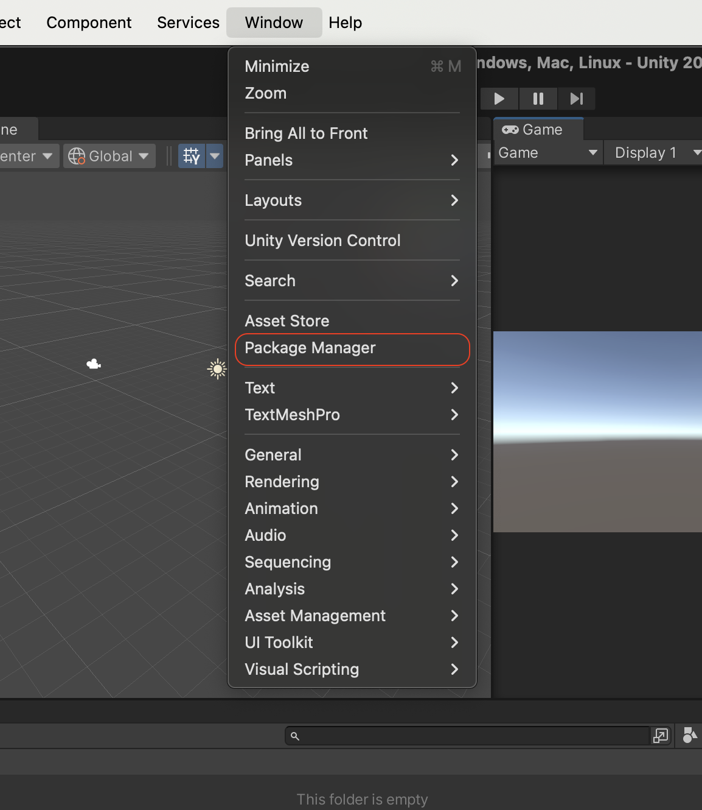
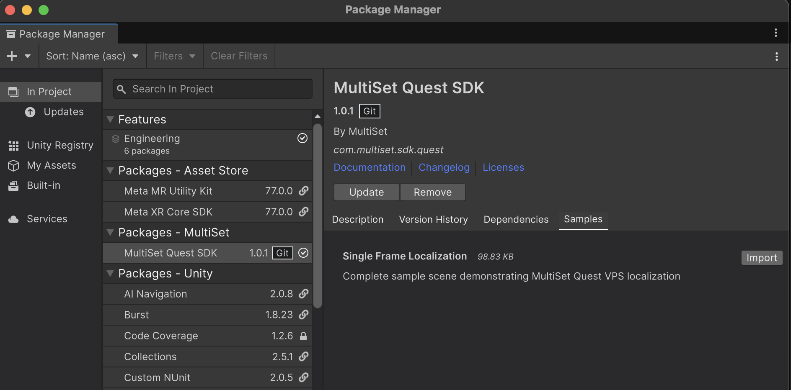
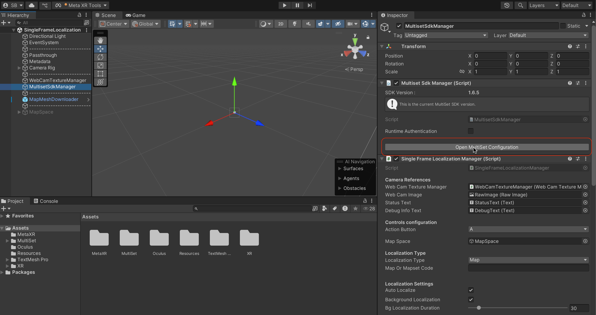
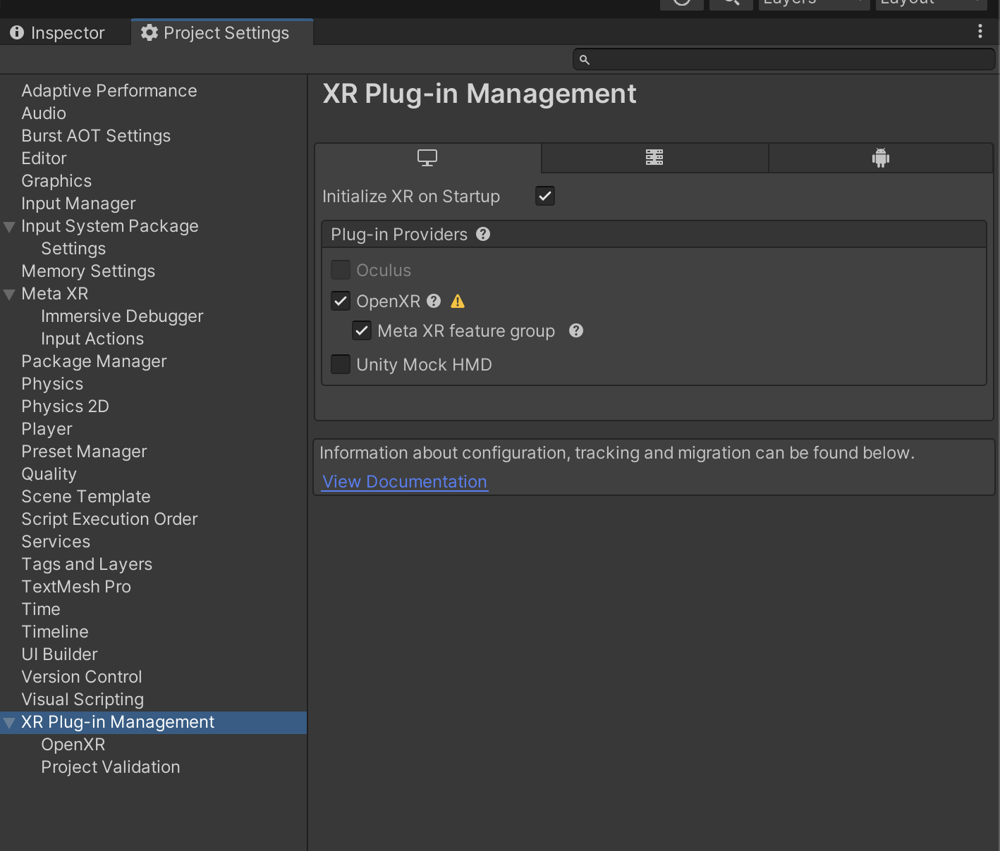
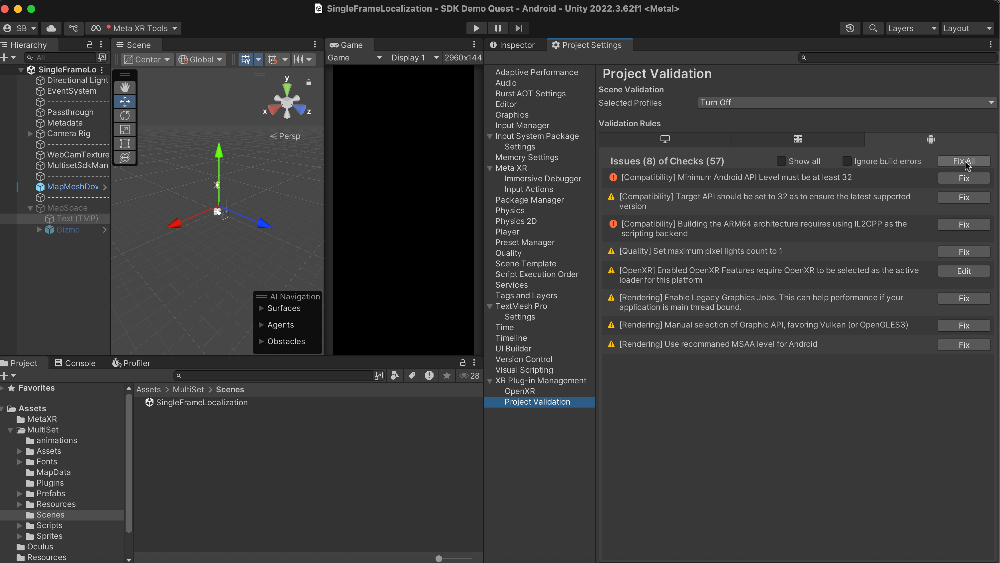
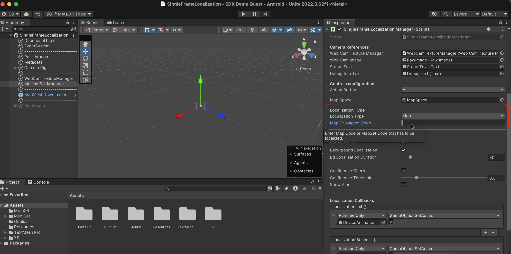

# MultiSet Quest SDK - Installation Guide

  

The MultiSet Quest SDK enables seamless integration of Visual Positioning System (VPS) capabilities into your Unity Meta Quest applications, providing accurate spatial localization and mesh visualization features.

## 📋 Prerequisites

Before you begin, make sure you have the following:

| Requirement | Details |
|-------------|---------|
| **Unity Version** | Unity 6.0+ (Recommended: 6000.0.55f1) |
| **Platform Support** | Android Build Support module |
| **Target Device** | Meta Quest 3 or Quest 3S |
| **Network** | Stable internet connection for VPS functionality |
| **API Access** | MultiSet API credentials from [multiset.ai](https://multiset.ai) |
| **Experience Level** | Basic Unity development knowledge |

## 🚀 Quick Start Installation

### Method 1: Git URL (Recommended)

1. **Create or open your Unity project**
   - New project: Select **3D (Built-In Render Pipeline)**
   - Existing project: Ensure compatibility with Unity 6.0+

2. **Add the SDK package**
   ```
   Window → Package Manager → + → Add package from git URL
   ```
   
3. **Enter the repository URL**
   ```
   https://github.com/MultiSet-AI/multiset-quest-sdk.git
   ```

4. **Verify installation**
   - Check that "MultiSet Quest SDK" appears under "In Project" in Package Manager



## 📦 Automatic Dependencies

The SDK automatically installs these essential packages:

- Unity Cloud - Draco (5.1.7)
- Unity Cloud - glTFast (6.8.0)
- Meta XR Core SDK (77.0.0)
- Meta MR Utility Kit (77.0.0)
- XR Plugin Management (4.5.1)
- OpenXR Plugin (1.15.1)

## 🎯 Import Sample Scenes

Get started quickly with our comprehensive examples:

1. **Open Package Manager** → Find "MultiSet Quest SDK"
2. **Navigate to Samples tab** → Click "Import" next to "Sample Scenes"
3. **Samples location**: `Assets/Samples/MultiSet Quest SDK/[version]/Single Frame Localization/Scenes/`

The sample scenes demonstrate core SDK functionality and serve as implementation references.



## ⚙️ Configuration Setup

### Step 1: API Credentials Configuration

Navigate to the configuration file:
```
Assets/Samples/MultiSet Quest SDK/[version]/Single Frame Localization/Resources/MultiSetConfig.asset
```

**Update your credentials:**
```csharp
Client Id = "YOUR_CLIENT_ID_HERE"
Client Secret = "YOUR_CLIENT_SECRET_HERE"
```

> 💡 **Get your credentials**: Visit [multiset.ai](https://multiset.ai) to obtain your Client ID and Secret



### Step 2: XR Plugin Management Setup

1. **Project Settings**: `Edit → Project Settings → XR Plug-in Management`
2. **Install if needed**: Click "Install XR Plugin Management"
3. **Enable OpenXR**: Check the OpenXR checkbox under Plug-in Providers



### Step 3: Android Platform Configuration

1. **Switch Platform**: `File → Build Settings → Android → Switch Platform`
2. **Validate Setup**: `Edit → Project Settings → XR Plug-in Management → Project Validation`
3. **Fix Issues**: Click "Fix All" to resolve any configuration problems



### Step 4: Map Configuration

Configure your localization settings in the sample scene:

1. **Open sample scene**: `SingleFrameLocalization.unity`
2. **Select MultisetSdkManager** GameObject in Hierarchy
3. **Configure localization method** in SingleFrameLocalizationManager component:

| Option | Use Case | Configuration |
|--------|----------|---------------|
| **Map** | Single, specific location | Enter **Map Code** |
| **MapSet** | Multiple locations or larger areas | Enter **MapSet Code** |



> 📍 **Obtain codes**: Get your Map/MapSet codes from the [MultiSet Developer Dashboard](https://developer.multiset.ai)

### Step 5: Camera Permissions

The SDK automatically configures required permissions. Verify in `Assets/Plugins/Android/AndroidManifest.xml`:

```xml
<uses-permission android:name="horizonos.permission.HEADSET_CAMERA" />
```

### Step 6: Quest Build Requirements

Ensure your project meets these requirements:

- ✅ Android Build Support installed
- ✅ Minimum API Level: 32 or higher
- ✅ XR Plugin Provider enabled
- ✅ Scripting Backend: IL2CPP
- ✅ Target Architecture: ARM64

## 🏗️ Build and Deploy

### Build Configuration

1. **Build Settings**: `File → Build Settings`
2. **Select Platform**: Android
3. **Add Scenes**: Click "Add Open Scenes"

**Essential Android Settings:**
- Scripting Backend: **IL2CPP**
- Target Architectures: **ARM64**
- Minimum API Level: **32+**

### Testing Deployment

1. **Build and Run**: Connect your Quest device and click "Build and Run"
2. **Grant Permissions**: Allow camera access when prompted
3. **Test Localization**: Verify functionality in your target environment
4. **Validate AR Features**: Ensure all AR capabilities work as expected

## 🛠️ API Reference

### Core SDK Components

| Component | Purpose |
|-----------|---------|
| `MultiSetSdkManager` | Main SDK entry point and manager |
| `SingleFrameLocalizationManager` | Handles VPS localization operations |
| `MapMeshHandler` | Manages 3D mesh visualization |


## ✅ Setup Verification Checklist

Ensure your setup is complete:

- [ ] Unity version 6000.0.55f1+ installed
- [ ] Android platform selected and configured
- [ ] OpenXR enabled in XR Plugin Management
- [ ] API credentials configured in MultiSetConfig
- [ ] Map/MapSet code entered in MultisetSdkManager
- [ ] HEADSET_CAMERA permissions in Android manifest
- [ ] Sample scene loads and runs without errors
- [ ] Project Validation shows no critical issues

## 🎓 Next Steps

**After completing setup:**

1. **Test Sample Scene**: Run `SingleFrameLocalization.unity` to verify everything works
2. **Explore Documentation**: Visit [docs.multiset.ai](https://docs.multiset.ai) for advanced features
3. **Start Integration**: Implement SDK components in your own Unity scenes
4. **Join Community**: Connect with other developers using the SDK

## 🔧 Troubleshooting

### Common Issues and Solutions

| Issue | Solution |
|-------|----------|
| **Package Manager Errors** | Update Unity Hub and Unity Editor to latest versions |
| **XR Plugin Problems** | Restart Unity after enabling OpenXR |
| **Build Failures** | Run Project Validation and fix all issues before building |
| **Credential Errors** | Verify Client ID and Secret from MultiSet dashboard |
| **Localization Issues** | Ensure stable internet connection and correct map codes |
| **Camera Permission Denied** | Manually grant camera permissions in Quest settings |

### Debug Steps

1. **Check Console**: Look for error messages in Unity Console
2. **Validate Credentials**: Ensure API credentials are correctly entered
3. **Network Connectivity**: Test internet connection on Quest device
4. **SDK Version**: Verify you're using the latest SDK version

## 📞 Support & Resources

### Get Help

- 📧 **Technical Support**: [support@multiset.ai](mailto:support@multiset.ai)
- 📚 **Documentation**: [docs.multiset.ai](https://docs.multiset.ai)
- 🌐 **Website**: [multiset.ai](https://multiset.ai)
- 👩‍💻 **Developer Portal**: [developer.multiset.ai](https://developer.multiset.ai)

### Community

Join our developer community for tips, best practices, and peer support.

## 🔄 Updates

### Automatic Updates

1. **Package Manager** → Find "MultiSet Quest SDK"
2. **Click "Update"** when available

### Manual Updates

Remove and re-add with latest Git URL:
```
https://github.com/MultiSet-AI/multiset-quest-sdk.git#latest
```

## 📄 License

This software is proprietary. See the LICENSE file for complete terms and conditions.

---

**SDK Version**: 1.8.0  
**Unity Compatibility**: 6000.0.55f1+  
**Platform**: Meta Quest 3/3S  
**Last Updated**: July 2025

---